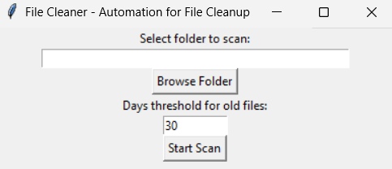

# File Cleaner - Automation for File Cleanup

## 📌 Overview
File Cleaner is a simple automation tool that helps you clean up old and duplicate files from a selected folder. It provides a user-friendly **GUI (Graphical User Interface)** using Tkinter, allowing users to scan and remove unnecessary files easily.

## ✨ Features
- ✅ **Select a folder** to scan
- ✅ **Identify old files** based on a user-defined threshold (in days)
- ✅ **Detect duplicate files** by computing file hashes
- ✅ **View scan results** before deletion
- ✅ **Confirm before deleting files** to prevent accidental removal
- ✅ **Lightweight GUI** with Tkinter
- ✅ **Standalone executable (.exe) option**

## 🛠️ Installation
To use the script, ensure you have Python installed.

1. **Clone the repository**:
   ```sh
   git clone https://github.com/LiorDaichman/FileCleanupTool.git
   cd file-cleaner
   ```
   2. **Enter to the folder**:
   ```sh
   cd FileCleanupTool
   ```
3. **Install dependencies**:
   ```sh
   pip install pyinstaller
   ```
4. **Run the exe file**:
   ```sh
   FileCleanupTool.exe
   ```

## 🚀 How I Creating an Executable (.exe)
If you want to run the program without Python installed, you can convert it to an executable file using **PyInstaller**:

```sh
pip install pyinstaller
pyinstaller --onefile --windowed FileCleanupTool.py
```
This will create a standalone `.exe` file inside the `dist/` folder.

## ⚠️ Disclaimer
- This tool **permanently deletes files**, so use it with caution.
- Always verify the files before confirming deletion.

## 📝 License
This project is licensed under the **MIT License**.

## 📩 Contact
For any questions or suggestions, reach out via **liordaichman@gmail.com** or open an issue on GitHub.

## 📷 Screenshot


